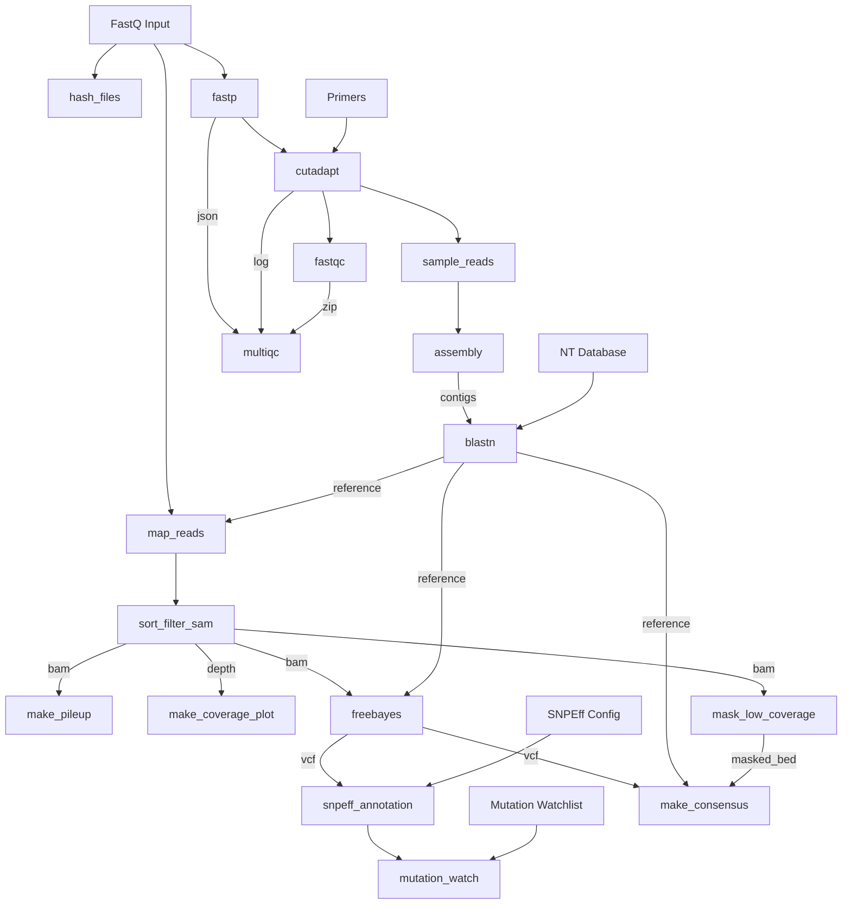

# fluscan-nf

This is a Nextflow pipeline for reference-based read mapping with a strong focus on calling nucleotide and amino acid mutations for Influenza A short-read sequence data. 
The pipeline further produces QC reports, coverage plots, pileups, consensus sequences, HA and NA subtype calls, clade calls, and more. 

## Analyses

- Read trimming & QC: [fastp](https://github.com/OpenGene/fastp)
- Primer removal with [cutadapt](https://github.com/marcelm/cutadapt)
- FASTQ quality reporting with [FastQC](https://www.bioinformatics.babraham.ac.uk/projects/fastqc/)
- Aggregate the reports with [MultiQC](https://multiqc.info/)
- Clade calls for H1, H3 and H5 influenza using [Nextclade](https://github.com/nextstrain/nextclade)
- Nucleotide variant calling using FreeBayes
- Annotation of amino acid variant calls using SnpEff
- Genotype calls using GenoFLU against curated database




## Input

Short read Illumina sequences, files ending in '.fastq.gz', '.fq.gz', '.fastq', '.fq'

## Usage

**Additional requirements for use:**  
- Package management is via Conda.  In addition, note the `-profile` and `--cache` switches, essential for proper operation of Conda on BCCDC systems.
- NOTE: if you have problems when first running the pipeline, it can be due to problems resolving the Conda environment.  If this is the case you can use mamba instead.


**Example command:**
```
nextflow run BCCDC-PHL/fluscan-nf \
  -r v0.1.0 \
  -profile conda \
  --cache ~/.conda/envs \
  --fastq_input /path/to/your_fastqs \
  --outdir /path/to/output_dir
```

## Output

Outputs are written to the directory specified with the `--outdir` parameter. 
One folder is produced per sample 


Output for each sample includes:

| File                        | Description                                                                                |
|-----------------------------|--------------------------------------------------------------------------------------------|
| `*_consensus.fasta`         | multifasta containing the consensus sequences for each segment                              |
| `*_ref.fasta`               | multifasta containing the optimal reference sequences selected for each segment                              |
| `*_blast.tsv`               | BLAST search results of assembled contigs against the reference database |
| `*_blast_filter.tsv`         | Filtered form of the BLAST search results above        |
| `*_coverage.png`            | line plots describing mapping coverage across all 8 flu segments                           |
| `*_pileup.tsv`              | Pileup in TSV containing raw counts of all 4 nucleotides and gaps                          |
| `*_depth.tsv`               | Simple TSV reporting the depth values at every position in the alignment (samtools depth)    |
| `vcf/*.vcf.gz`             | list of mutations in variant call format (VCF) called relative to the reference sequence (FreeBayes)  |
| `vcf/*_anno.vcf`            | VCF with amino acid annotations provided by SnpEff    |
| `vcf/*_mutations.tsv`            | Filtered, reformatted VCF used to make mutation identification easier                     |
| `vcf/*_mut_watch.tsv`            | A filtered list of mutations that are also present on the provided watchlist          |
| `genoflu/*_stats.tsv`       | tabular list of genotype call information for the sample's consensus sequences             |

Output for each run includes:

| File                  | Description                                                                     |
|-----------------------|---------------------------------------------------------------------------------|
| `multiqc_report.html` | MultiQC report summarizing the fastp results for the all the samples in the run |


## Provenance files

For each pipeline invocation, each sample will produce a `provenance.yml` file with the following contents.  Note the below is a contrived example.  

```yml
- pipeline_name: BCCDC-PHL/fluscan-nf
  pipeline_version: 0.1.0
  nextflow_session_id: 59fdd919-fc28-4af5-99e0-60355b11807c
  nextflow_run_name: hopeful_bhaskara
  timestamp_analysis_start: 2024-07-15T16:30:11.150887-07:00
- input_filename: sample-01_R1.fastq.gz
  file_type: fastq_input
  sha256: 2c1d5b310a5ca11cc2b1665c094a064fc3aa597e06f392985dac639bd2ab4d81
- input_filename: sample-01_R2.fastq.gz
  file_type: fastq_input
  sha256: 73745eed4badc3594cdd8554e90c75ae4b9b4599ca255064415ded433e598749
- process_name: fastp
  tools:
    - tool_name: fastp
      tool_version: 0.23.2
- process_name: cutadapt
  tools:
    - tool_name: cutadapt
      tool_version: 4.4
- process_name: assembly
  tools:
    - tool_name: spades
      tool_version: v3.15.3
process_name: nextclade
tools:
  - tool_name: nextclade
    tool_version: 3.8.1
    subcommand: run
- process_name: snp_calling
  tools:
    - tool_name: blastn
      tool_version: 2.15.0+
  databases:
    - database_name: blastn_db.fasta
- process_name: genoflu
  tools:
    - tool_name: genoflu
      tool_version: 1.03
```
